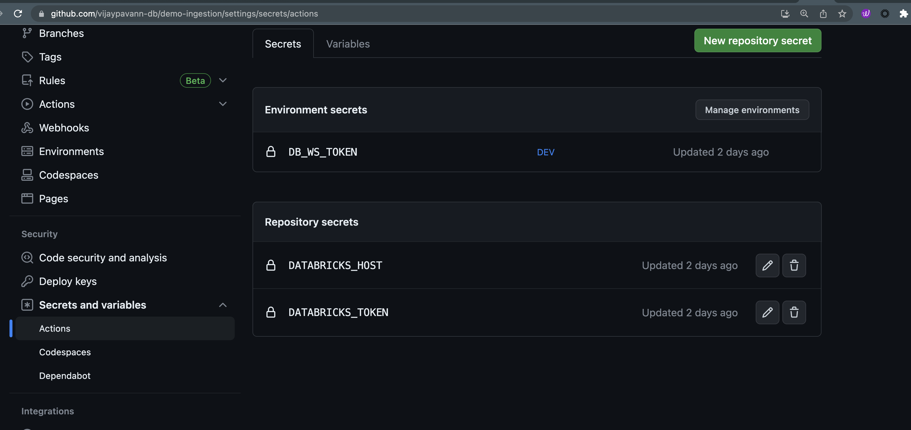

# databricks-sdk-demo
Databricks SDK for Python : Usages and Examples

## Project Setup
>### Step 1: How to clone the Repo
   
   1. Clone the repo using "`git clone <REPO_URL>`"

      `git clone https://github.com/vijaypavann/databricks-sdk-demo.git`
     
>### Step 2: Open the project in VS Code. Install `python3.10` and create a Virtual Env [run  on Terminal]

   ```python
      python3.10 -m venv ./.pvenv
      source .pvenv/bin/activate
   ```
   
   * Use the same name for virtualenv `.pvenv` [Python Virtual Env], as it's already added in `.gitignore` file.

>### Step 3: Project Inital Setup [First Time Setup]
* Run `sh run-setup.sh` on Terminal
* It includes build creation 

  #### Run Build [for new changes]
    * Run `sh run-build.sh` on Terminal

>### Step 4: Verify the Wheel(.whl) file [in dist/] is of correct format as below: 
`{dist}-{version}(-{build})?-{python.version}-{os_platform}.whl`


>### Step 5: Run Code locally for development / testing
1. Install the module as below: 
`pip install dist/databricks_sdk_demo-1.0-py3-none-any.whl  [--force-reinstall]`


--- 
## Executing SDK Examples

>### Run Repos Code (repos/repo_db_ws_sync.py) as part of CI / CD process
      
      Set these Secret variables as shown here:



      `DATABRICKS_HOST: ${{ secrets.DATABRICKS_HOST }}`
      `DATABRICKS_TOKEN:  ${{ secrets.DATABRICKS_TOKEN }}`
      `GIT_CHECKOUT_PATH:  ${{ secrets.GIT_CHECKOUT_PATH }}`

>### Run Repos Examples
   1. Go to `repos` dir, open `repo_db_ws_sync.py` and `Run as Python file` with `--git_checkout_path` and `--branch_name` arguments.

           OR

   1. [On Terminal] python `repos/repo_db_ws_sync.py --git_checkout_path ${GIT_CHECKOUT_PATH} --branch_name main` 

 